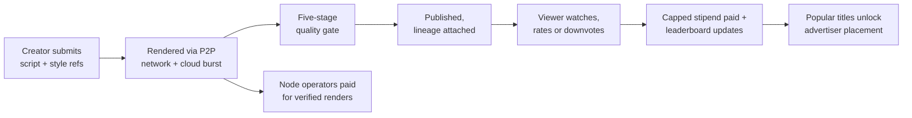
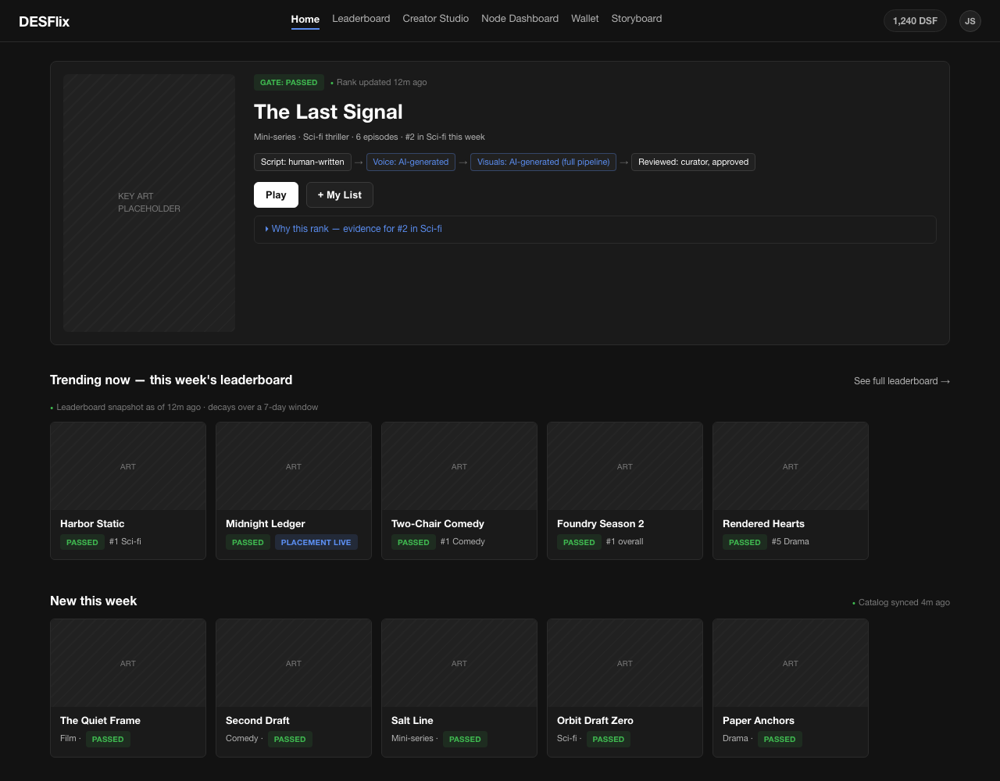
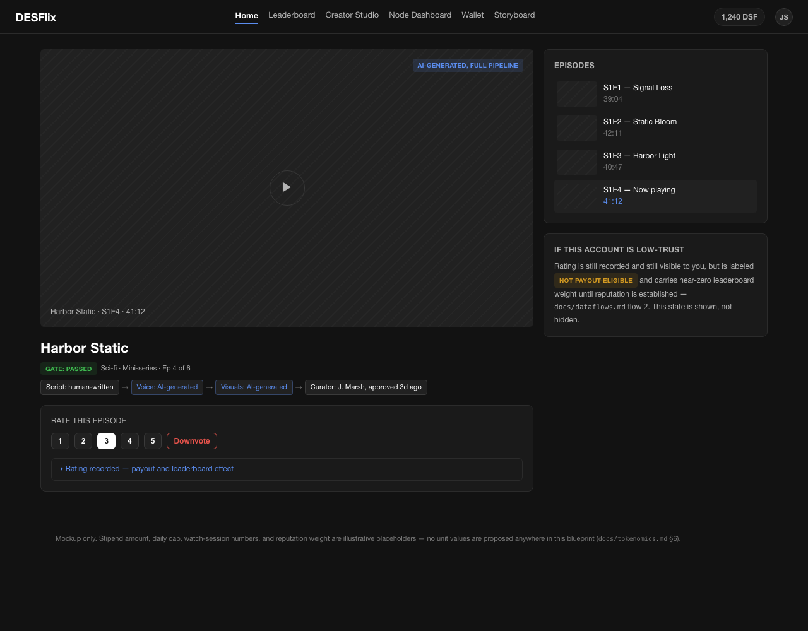
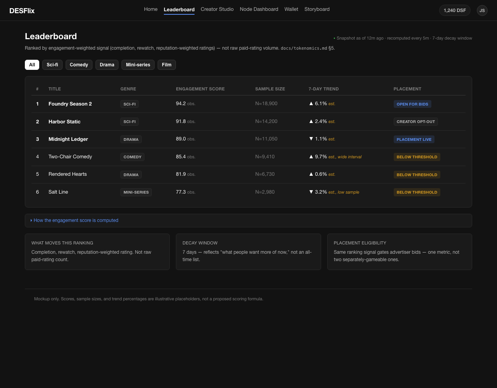
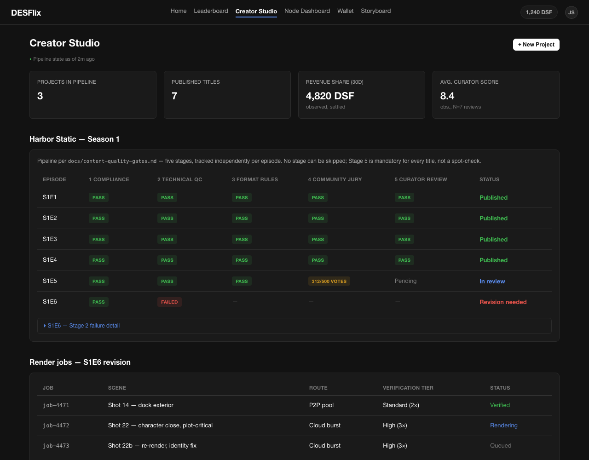
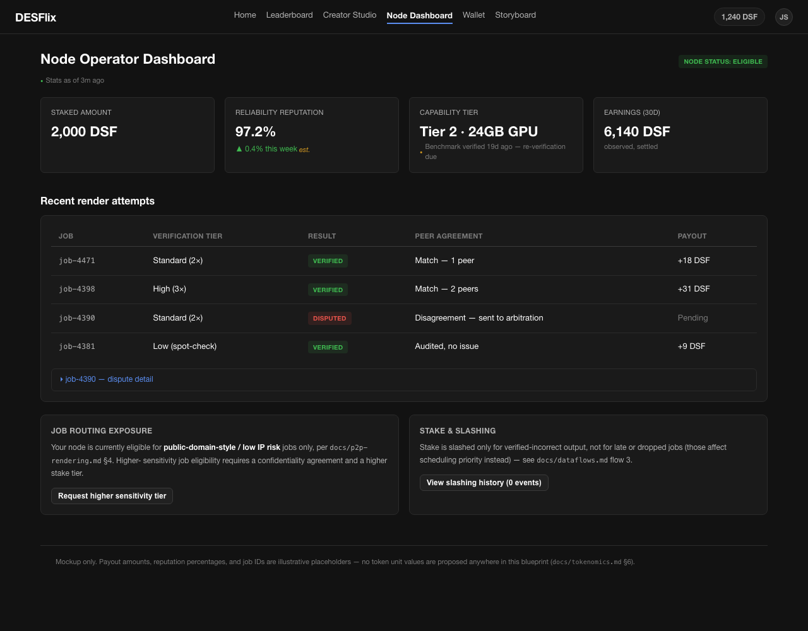
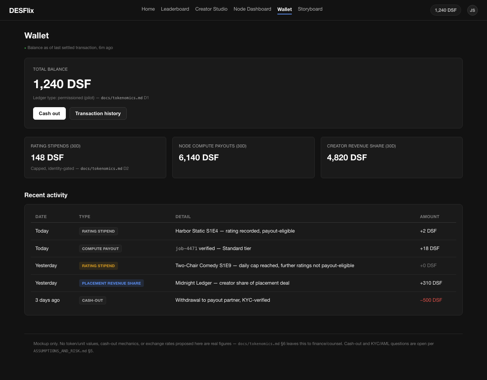
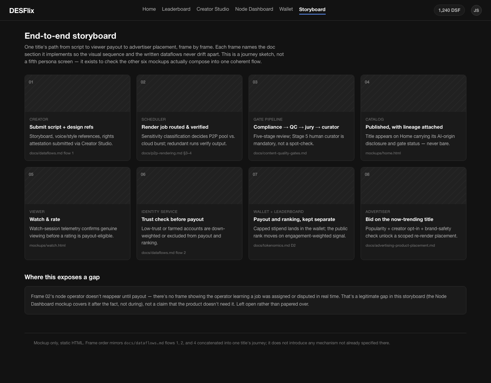

# DESFlix

**Stories an AI can render, that still have to earn their spot.**

DESFlix is a streaming platform for AI-generated series, mini-series,
films, and comedy, built on one bet: the bottleneck in AI content is
taste, not generation. Anyone can produce video now. Almost none of it is
worth watching. DESFlix enforces that bar -- five review stages between a
script and a published title, nothing under a full episode ships, and the
rendering compute that makes it affordable to independent writers comes
from a distributed P2P network instead of a studio's server farm.
Viewers get paid to rate what they watch. What people actually want more
of decides the leaderboard -- and what earns advertiser placement.

This repo is the complete pre-build blueprint: architecture, workflow,
data model, token economics, and working UI mockups. No application code
yet -- this is the design phase, done rigorously, including the parts
that don't work yet and the assumptions that could be wrong.

## The problem

Generative video removed the cost of production and left the cost of
judgment untouched. The result is a flood of technically-competent,
narratively-empty content with nowhere selective enough to filter it and
no economic reason for a platform to bother -- volume monetizes fine
without curation. Writers and creators with a real story and no production
budget get buried in the same feed as the flood. And the platforms best
positioned to fix this have no incentive to: engagement, not quality, is
what they're built to maximize.

## The idea

Put a real editorial bar between generation and publication, make the
compute cheap enough with distributed rendering that an independent
creator can actually afford to clear that bar, and pay the audience
directly for the one thing that's currently free and unrewarded: having
taste and saying so.

## How it works

1. **A creator submits a project.** Script, storyboard, voice and visual
   style references, in the Creator Studio -- see the mockup.
2. **It gets rendered.** Scenes are broken into jobs and routed either to
   the P2P compute network or to centralized cloud burst capacity,
   depending on how IP-sensitive or plot-critical the shot is. P2P jobs
   are verified by independent, redundant runs before anything is
   accepted -- a node doesn't get paid for output nobody else can confirm.
3. **It passes a five-stage quality gate.** Automated compliance and
   technical QC, a hard runtime floor that rules out short-form filler
   dressed up as an episode, a community jury, then a professional
   curator review that is mandatory for every title, not a spot-check.
   This is the "no AI slop, quality gates like Netflix" requirement,
   built as a structural pipeline rather than a promise.
4. **It publishes with its lineage attached.** Every title carries a
   visible record of what was AI-generated and what was human-authored,
   plus its full gate history. Nothing ships as an opaque black box.
5. **Viewers watch, rate or downvote, and get paid.** The payout is a
   flat, capped, identity-gated stipend, not an open-ended reward per
   rating -- deliberately, because an open-ended reward for the exact
   number that also ranks content is a well-documented way to get bots
   instead of taste. More on this below.
6. **The leaderboard tracks real demand.** Ranked by completion rate,
   rewatch rate, and reputation-weighted rating, decaying over a rolling
   window, broken out by genre. Not by raw vote count. This is the signal
   that tells creators and the platform what people actually want more of
   -- the mechanism the original brief asked for.
7. **Popular titles unlock advertiser placement.** Because the content is
   rendered rather than filmed, a brand deal can be a scoped re-render of
   one prop or one background, not a reshoot -- with creator opt-in and
   revenue share, gated by the same brand-safety review as everything
   else.
8. **Compute contributors get paid for verified work.** Node operators
   earn for render jobs their output survives independent verification
   on. Stake is slashed only for provably wrong output, never for being
   slow.

The full technical version of this flow, with failure modes named at each
step, is in [`docs/dataflows.md`](./docs/dataflows.md). The same sequence,
sketched frame by frame with the same terminology, is
[`mockups/storyboard.html`](./mockups/storyboard.html).

## See it

Actual screenshots of the HTML/CSS in `mockups/` -- headless Chrome, 1280px
viewport. These can't drift from what the files in this repo show, because
they're captures of those files, not separate artwork. Design rationale is
in `mockups/index.html`'s "UI design references" section.

| | |
|---|---|
| **[Home / Discovery](./mockups/home.html)** | **[Watch + Rate](./mockups/watch.html)** |
|  |  |
| **[Leaderboard](./mockups/leaderboard.html)** | **[Creator Studio](./mockups/creator-studio.html)** |
|  |  |
| **[Node Operator Dashboard](./mockups/node-dashboard.html)** | **[Wallet](./mockups/wallet.html)** |
|  |  |
| **[End-to-End Storyboard](./mockups/storyboard.html)** | |
|  | |

## What makes it different

- **A quality gate with teeth.** Five stages, and the human curator stage
  is mandatory for every title, because subjective creative quality isn't
  the kind of thing current classifiers judge at an editorial standard --
  claiming otherwise would be the one dishonest sentence in this pitch.
- **P2P compute at production quality.** Independent creators get
  production-grade rendering without production-grade cloud bills,
  verified by redundant runs instead of trust.
- **Getting paid to have taste.** Rating pays -- capped and identity-gated,
  so the reward can't be farmed at the scale that would corrupt it -- and
  the public leaderboard runs on a separate, harder-to-game signal so the
  number that pays you and the number that ranks content are never the
  same number.
- **Placement that only a rendered platform can do.** A branded prop can
  be swapped into a scene that's already trending, without reshooting
  anything -- a capability that doesn't exist for filmed content.

## The blueprint

- [`ASSUMPTIONS_AND_RISK.md`](./ASSUMPTIONS_AND_RISK.md) -- every
  assumption this design rests on, stated explicitly, plus the
  fact/inference/speculation breakdown and feasibility confidence behind
  the claims made above.
- [`docs/architecture.md`](./docs/architecture.md) -- context diagram,
  container diagram, subsystem responsibilities, and a phased rollout that
  sequences the riskiest subsystems after the independently-defensible
  core product.
- [`docs/dataflows.md`](./docs/dataflows.md) -- the four flows above as
  full sequence diagrams, each with the failure modes specific to it.
- [`docs/content-quality-gates.md`](./docs/content-quality-gates.md) --
  the five-stage gate in full, including the operational rubric for what
  "AI slop" actually means and its known Goodhart's-Law risk.
- [`docs/p2p-rendering.md`](./docs/p2p-rendering.md) -- the distributed
  render network: node lifecycle, tiered verification, job routing by IP
  sensitivity, and why this is the least-proven subsystem here.
- [`docs/tokenomics.md`](./docs/tokenomics.md) -- the payout and
  leaderboard mechanism in full, including the open ledger decision (`D1`)
  and the anti-Sybil design (`D2`).
- [`docs/vote-integrity.md`](./docs/vote-integrity.md) -- the full no-
  spam-votes pipeline: signals, scoring, the three-band decision logic,
  Sybil-cluster detection, appeals, and what it explicitly doesn't solve.
- [`docs/advertising-product-placement.md`](./docs/advertising-product-placement.md)
  -- the placement marketplace, planned vs. reactive placement, and
  disclosure requirements.
- [`docs/data-model.md`](./docs/data-model.md) -- the conceptual entities
  tying every subsystem's vocabulary together.

## What we're still proving

Three things here are designed-for, not demonstrated, and this blueprint
says so on purpose instead of quietly hoping nobody asks:

- **Paying for ratings is a known way to buy bots instead of taste**,
  unless the anti-Sybil design actually holds at scale. Every independent
  token-curation platform with this pattern has this failure mode in its
  history. The mitigation -- capped stipends decoupled from the ranking
  signal -- is designed against that specific, repeated failure, not
  against a hypothetical one. See `docs/tokenomics.md` `D2` and
  `ASSUMPTIONS_AND_RISK.md` sec. 3.
- **Volunteer P2P compute has real precedent for batch-tolerant, easy-to-
  verify work.** Generative rendering is neither, and the redundant-run
  verification this design requires may erase the cost advantage that's
  the whole point of the P2P network. See `docs/p2p-rendering.md` sec. 3.
- **Whether the token is a security or a money-transmission instrument is
  an open legal question**, not a design decision this blueprint is
  qualified to make. See `ASSUMPTIONS_AND_RISK.md` sec. 5.

Full analysis, including what evidence would change our mind on each of
these, is in `ASSUMPTIONS_AND_RISK.md`.

## Status

Blueprint complete: architecture, workflow, data model, tokenomics,
quality-gate design, and working UI mockups. No application code exists
yet -- that's the next phase, not this repo.
