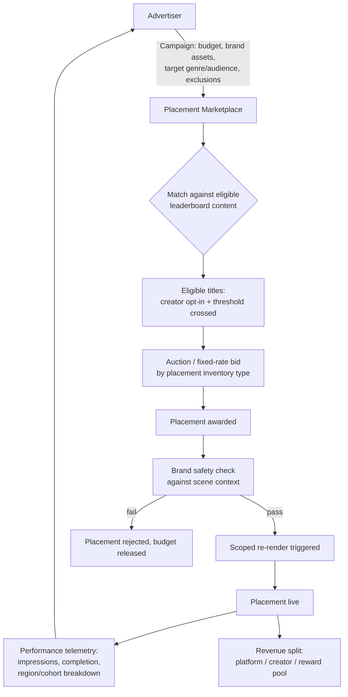

# DESFlix -- Advertising and Product Placement

Brief: "companies can pay for product placements if something becomes
popular." Read as: placement deals are triggered/priced by leaderboard
performance, and the AI-rendering pipeline lets placement be inserted
without a full reshoot (`ASSUMPTIONS_AND_RISK.md` A8). This is one of the
higher-confidence differentiators in the blueprint (sec. 6: medium-high) because
it follows directly from the generative pipeline's technical properties,
but it has not been piloted.

## 1. Placement model

Two placement types, because they have different technical cost and
different brand-safety/consent implications:

| Type | Mechanism | When it applies |
|---|---|---|
| **Planned placement** | Creator/studio negotiates a brand integration at production time; asset is part of the original render, same as traditional film/TV placement | Any title, regardless of popularity -- this is the traditional model and needs no new capability |
| **Reactive placement** (the differentiated one) | Advertiser bids on *already-published, already-popular* content; a scoped re-render swaps a background asset, prop, or signage without touching plot-critical elements | Only titles that have cleared the Quality Gate and crossed a leaderboard/engagement threshold |

Reactive placement is what "pay for placement if something becomes popular"
actually requires architecturally, and is the focus of the rest of this
document.

## 2. Reactive placement flow

See `dataflows.md` flow 4 for the full sequence diagram. Key constraints
not to lose in implementation:

- **Creator consent is required, not implied by popularity.** A title
  becoming popular does not automatically make it available for placement
 -- the creator/rights-holder opts in per title (or sets a standing
  preference), and shares in placement revenue (see `tokenomics.md` sec. 3).
  Popularity triggers advertiser *interest and eligibility*, not automatic
  insertion.
- **Placement is scoped, not a full re-render.** Only the specific
  asset(s) being swapped are regenerated; this keeps cost low and avoids
  re-litigating the Quality Gate for the entire title. The swapped
  asset(s) still pass a narrower automated technical QC (Stage 2 of
  `content-quality-gates.md`) so a placement can't reintroduce visual
  artifacts.
- **Brand safety check is mandatory and runs against the specific content
  context**, not just the title's overall rating -- a brand should not land
  in a scene whose specific tone/content conflicts with it even if the
  title as a whole is popular and gate-approved.

## 3. Placement marketplace

## 4. Scoping and cohort targeting

Because placement is a re-render rather than a fixed asset, it can
plausibly vary by region or viewer cohort (e.g., a regionally-relevant
brand shown to one market, a different brand or no placement shown to
another). This is drawn as a capability of the architecture
(`architecture.md` container diagram -- Placement & Ad Engine feeding
scoped Catalog variants), not a promise that per-viewer real-time
personalized placement is in scope for an early version -- that's a
materially more complex targeting/serving problem than title-level or
region-level variants and should be treated as a later capability, not a
Phase 1/2 requirement (`architecture.md` sec. 5).

## 5. Disclosure and compliance

- Placements are labeled as paid placement in metadata (extends the
  AI-origin disclosure metadata already required by
  `content-quality-gates.md` sec. 4), consistent with standard advertising-
  disclosure practice for paid integrations.
- Advertiser-supplied brand assets go through the same rights/ownership and
  technical QC checks as creator-submitted assets before being eligible for
  render -- an advertiser's asset is not a trusted bypass of the Quality
  Gate pipeline.
- Regional advertising-disclosure and endorsement regulations vary; not
  enumerated here -- flagged consistent with `ASSUMPTIONS_AND_RISK.md` sec. 5 as
  a compliance question for the specific target markets, not resolved in
  this blueprint.

## 6. Why popularity-gating placement (rather than any-title placement) matters

Ties placement eligibility to the same engagement-weighted leaderboard
signal used elsewhere (`tokenomics.md` sec. 5), specifically so that gaming
placement revenue requires gaming the same hard-to-game signal as gaming
the public leaderboard -- it does not introduce a second, separately-
exploitable "become eligible for ad revenue" metric alongside the
viewer-facing leaderboard. Two independently-gameable popularity metrics
would be strictly worse than one.
