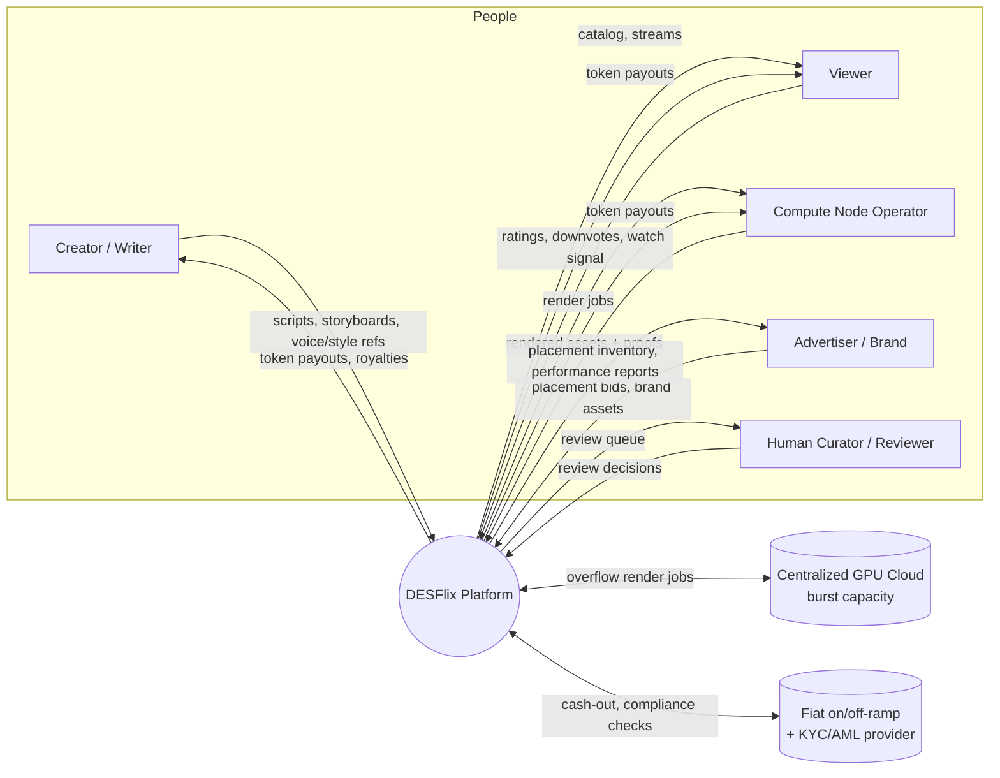
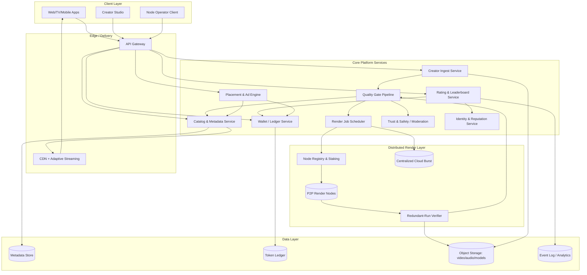
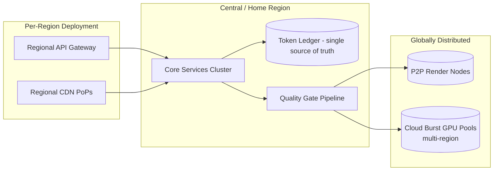
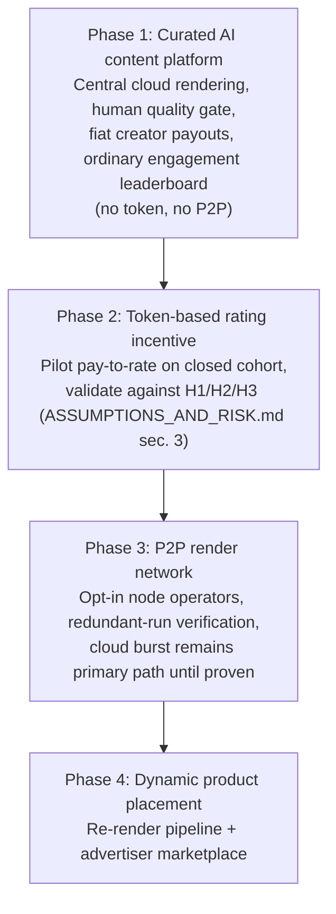

# DESFlix -- System Architecture

Status: conceptual blueprint, no implementation. See `../ASSUMPTIONS_AND_RISK.md`
for the assumptions (`A1`-`A9`) this architecture is built on, and for the
feasibility caveats on the P2P-rendering and tokenomics subsystems in
particular -- this document describes what those subsystems would need to do,
not a claim that the approach is proven.

## 1. Context diagram -- who and what DESFlix talks to

## 2. Container diagram -- major subsystems

## 3. Subsystem responsibilities

| Subsystem | Responsibility | Key risk flagged in ASSUMPTIONS_AND_RISK.md |
|---|---|---|
| Creator Ingest Service | Intake scripts, storyboards, voice/style refs, casting/character models; versioned project workspace | -- |
| Quality Gate Pipeline | Multi-stage review: automated compliance checks -> automated technical QC -> human curator review -> publish decision. See `content-quality-gates.md`. | Automated creative-quality gating is low-confidence without human review (sec. 2.2, sec. 6) |
| Render Job Scheduler | Breaks a project into renderable jobs (per-scene/per-shot), assigns to P2P nodes or cloud burst based on SLA, sensitivity, and cost | -- |
| Node Registry & Staking | Onboards compute contributors, tracks stake/reputation, assigns jobs, slashes for bad output | P2P viability unproven for this workload (sec. 2.3) |
| Redundant-Run Verifier | Runs sensitive jobs on 2+ independent nodes and compares output (perceptual hash / statistical agreement) before accepting | Verification cost directly offsets any P2P cost advantage -- see `p2p-rendering.md` |
| Rating & Leaderboard Service | Collects ratings/downvotes, computes leaderboard, feeds Wallet for payout | Pay-per-rating signal integrity is the platform's single biggest open risk (sec. 3) |
| Identity & Reputation Service | Proof-of-personhood, account reputation, Sybil-resistance signal shared by Rating and Node Registry | Anti-Sybil infra is expensive and imperfect (sec. 3, H1) |
| Wallet / Ledger Service | Token balances, payouts to raters/creators/node operators, advertiser billing, fiat on/off-ramp integration | Legal/regulatory questions open (sec. 5) |
| Placement & Ad Engine | Matches advertiser campaigns to trending content, triggers dynamic asset re-render, tracks placement performance | Depends on re-render pipeline (A8) |
| Trust & Safety / Moderation | Content policy enforcement, appeals, takedown, abuse response | -- |
| CDN + Adaptive Streaming | Standard video delivery; not differentiated from any other streaming platform | -- |

## 4. Deployment topology (conceptual, not infra-as-code)

Notes:
- The token ledger is drawn as a single source of truth, not "the blockchain
  handles consistency" -- whether it's a permissioned ledger, an
  application-managed database, or an actual public chain is `[DECISION]`
  D1 in `tokenomics.md`, deliberately not resolved by this diagram.
- Cloud burst capacity exists in the architecture from day one, not as a
  fallback bolted on later -- per the steelman counterargument in
  `ASSUMPTIONS_AND_RISK.md` sec. 3, the platform should be able to run its core
  content-quality value proposition even if the P2P layer underperforms.

## 5. Phased rollout (addresses the steelman counterargument directly)

The riskiest, least-proven pieces (P2P rendering, token payouts) are
sequenced *after* the parts of the product that are independently
defensible, so a P2P or tokenomics failure doesn't take down the whole
platform.

Each phase has an explicit go/no-go gate tied to the falsification criteria
in `ASSUMPTIONS_AND_RISK.md` sec. 4 -- a phase does not proceed on schedule, it
proceeds on evidence.
