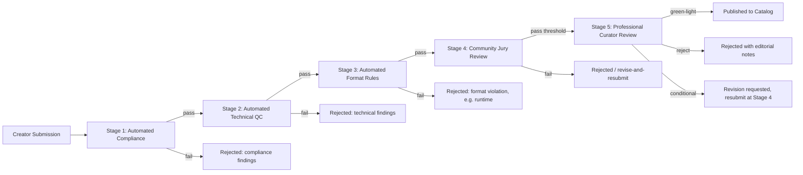

# DESFlix — Content Quality Gates

Goal stated by the product brief: "No AI slop, no shorts, quality gates like
Netflix." This document treats those as three separable requirements, because
they need different mechanisms and have different feasibility confidence
(see `ASSUMPTIONS_AND_RISK.md` §6):

1. **No shorts** — a checkable, objective runtime/format rule. High confidence, trivial to enforce.
2. **No AI slop (compliance sense)** — checkable defects: technical QC, policy violations, plagiarism/duplication, undisclosed-AI mislabeling. High confidence, automatable.
3. **No AI slop (creative sense) / "Netflix-grade"** — subjective narrative and production quality. Low confidence this is automatable at all; this document designs around a mandatory human review stage rather than pretending otherwise.

## 1. The gate pipeline

### Stage 1 — Automated compliance
Checkable, policy-based, no subjective judgment:
- Prohibited content categories (CSAM, non-consensual real-person deepfakes,
  hate content, etc. — full policy list is a Trust & Safety artifact, not
  duplicated here).
- Rights/ownership attestation present and internally consistent (matches
  creator account, no conflicting prior claim in the system).
- AI-origin disclosure metadata present and accurate (see §4).
- Plagiarism/duplication check against existing catalog and known public
  works (embedding-similarity search against script/story and against
  rendered frames).

### Stage 2 — Automated technical QC
Objective production-quality checks that do not require judging *taste*:
- Audio/video sync within tolerance.
- No unresolved rendering artifacts above a defined visual-QA threshold
  (banding, temporal flicker, model "hallucination" artifacts like extra
  fingers/limbs, text corruption in in-scene signage, etc.).
- Consistent character/asset identity across shots (a known failure mode of
  generative video: the same character looking different scene-to-scene).
- Loudness/format/delivery-spec compliance (mirrors standard broadcast QC
  practice, adapted to a generative pipeline).

### Stage 3 — Automated format rules
- **Runtime floor** enforces "no shorts": content below the minimum runtime
  threshold is rejected at this stage, full stop. Threshold is a tunable
  platform parameter (open question, see §5) — e.g., an episode minimum and
  a separate film minimum, both well above short-form-clip length.
- Trailers, recaps, and behind-the-scenes featurettes are the one carve-out
  that legitimately needs to be shorter than the runtime floor; they are
  tagged as a distinct content type at ingest so the floor doesn't
  accidentally block legitimate marketing assets while still blocking
  short-form filler dressed up as "episodes."

### Stage 4 — Community jury review
A panel of verified, reputation-weighted viewers (not the general public
vote used for the leaderboard — a separate, smaller, higher-trust pool,
because this stage's output gates publication, unlike leaderboard ratings
which are post-publication signal). Panel composition and payout mechanics
mirror the anti-Sybil controls in `tokenomics.md`, since a gameable jury is
exactly the same failure mode as a gameable leaderboard.

### Stage 5 — Professional curator review
Paid human editorial reviewers, the direct analog of a streamer's
acquisitions/editorial team. This stage exists specifically because Stage
1–4 cannot reliably judge whether a story is actually *good* — see
`ASSUMPTIONS_AND_RISK.md` §2.2. Curator decisions are the final gate before
publication and are the accountable, appealable decision (creators can
appeal a rejection; automated-stage rejections are also appealable but
resolve faster since they're checking objective criteria).

## 2. Why an automated-only gate is explicitly rejected here

A design that stops at Stage 3 and calls the result "Netflix-grade" would
be overclaiming: Stages 1–3 can only catch what's *checkable*, and creative
quality is not fully checkable by current classifiers (low confidence per
`ASSUMPTIONS_AND_RISK.md` §6). Recommended validation before trusting any
automated creative-quality scoring model this platform might build later:
score it against a human-expert-labeled test set and require it to beat a
trivial baseline (raw engagement metrics) before it's allowed to gate
anything by itself. Until that validation exists, Stage 5 stays mandatory
for every title, not a spot-check.

## 3. Defining "AI slop" as an operational rubric (not vibes)

Rubric categories used at Stage 5, scored by curators on a fixed scale
(exact scale is an implementation detail; the categories are the design
contribution here):

- **Narrative coherence** — plot holds together, character motivation is
  legible, pacing serves the story.
- **Production consistency** — visual/audio identity holds across the full
  runtime (the generative-specific failure mode called out in Stage 2, but
  judged holistically here rather than shot-by-shot).
- **Originality** — not a thin reskin of an existing catalog title or an
  obvious template output; curators have visibility into the creator's
  prompt/generation history to judge how much creative direction shaped the
  result versus default model output.
- **Craft intent** — evidence of deliberate creative choices (framing,
  performance direction via prompt/voice design, editing rhythm) as opposed
  to first-pass, unrevised generation output.

Known risk: once creators know the rubric, they will optimize toward it
(Goodhart's Law, flagged in `ASSUMPTIONS_AND_RISK.md` §2.3). Mitigation is
procedural, not technical: rubric categories are public, but specific
scoring thresholds and curator notes are not, and the rubric is revised on
a regular cadence precisely because a static, fully-known rubric degrades
over time as creators learn to satisfy it mechanically.

## 4. AI-origin disclosure

Every published title carries structured metadata: which stages of
production were AI-generated (script assist, voice, visual generation,
full pipeline), which were human-authored, and which creator/studio is
accountable. This is a labeling requirement, not a quality judgment — fully
AI-generated content can still pass Stage 5; the disclosure exists for
viewer transparency and advertiser brand-safety review (`dataflows.md` flow 4),
and plausibly for regulatory disclosure requirements in some jurisdictions
(unverified, flagged consistent with `ASSUMPTIONS_AND_RISK.md` §5).

## 5. Open parameters (explicitly not decided here)

- Exact runtime floor for "no shorts" (episode minimum, film minimum).
- Community jury pass threshold and panel size.
- Cadence for rubric revision.
- Whether Stage 5 curators are platform employees, a paid contractor pool,
  or a hybrid — a headcount/cost decision outside this blueprint's scope.
