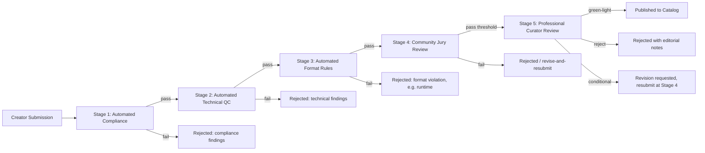

# DESFlix -- Content Quality Gates

Goal stated by the product brief: "No AI slop, no shorts, quality gates like
Netflix." This document treats those as three separable requirements, because
they need different mechanisms and have different feasibility confidence
(see `ASSUMPTIONS_AND_RISK.md` sec. 6):

1. **No shorts** -- a checkable, objective runtime/format rule. High confidence, trivial to enforce.
2. **No AI slop (compliance sense)** -- checkable defects: technical QC, policy violations, plagiarism/duplication, undisclosed-AI mislabeling. High confidence, automatable.
3. **No AI slop (creative sense) / "Netflix-grade"** -- subjective narrative and production quality. Low confidence this is automatable at all; this document designs around a mandatory human review stage rather than pretending otherwise.

## 1. The gate pipeline

### Stage 1 -- Automated compliance
Checkable, policy-based, no subjective judgment. Each check names the
general technique category it would use; none of these are claimed as
solved or vendor-specific -- they're established categories of technique
(policy classification, embedding similarity), not a promise about
detection accuracy, which is unverifiable without a pilot.

| Check | Method | Decision on trigger |
|---|---|---|
| Prohibited content (CSAM, non-consensual real-person deepfakes, hate content, etc.) | Policy classifier scored against the full Trust & Safety category list (not duplicated here) | Auto-reject, no appeal path for the highest-severity categories; routed to human Trust & Safety review for borderline categories |
| Rights/ownership attestation | Consistency check: attestation matches creator account, no conflicting prior claim in `CREATOR_PROJECT` records | Auto-reject with the specific conflict cited; creator can resubmit with corrected attestation |
| AI-origin disclosure accuracy | Cross-check declared pipeline stages (script/voice/visual) against render job metadata from Stage 2 of `dataflows.md` flow 1 | Mismatch auto-rejects with the specific discrepancy; this is the one check that would otherwise let a creator understate AI involvement undetected |
| Plagiarism / duplication | Embedding-similarity search: script/story text against the catalog and known public works; perceptual-hash sampling of rendered frames against the catalog | Similarity above a high threshold (e.g., >0.92 on the similarity metric) does not auto-reject -- near-duplicate isn't necessarily plagiarism (parody, homage, genre convention all score high) -- it routes to Stage 5 curator with the matched source cited, so a human makes the call a similarity score can't |

### Stage 2 -- Automated technical QC
Objective production-quality checks that do not require judging *taste*.
Same caveat as Stage 1: technique categories are named, accuracy is not
claimed.

| Check | Method | Decision on trigger |
|---|---|---|
| Audio/video sync | Cross-correlation of the audio waveform against mouth-movement/timing markers; tolerance band, e.g. under 80ms drift | Above tolerance: auto-reject, cites the timestamp and measured drift |
| Rendering artifacts | Frame-level anomaly scoring against a reference distribution (banding, temporal flicker, model "hallucination" artifacts like extra fingers/limbs, text corruption in in-scene signage) | Flagged-frame rate above a threshold auto-rejects; a low flagged-frame rate is sampled for a fast human spot-check rather than auto-passed, since anomaly scores have real false-positive/false-negative rates that aren't known without a pilot |
| Character/asset identity consistency | Face/asset embedding similarity tracked scene-to-scene for the same named character (the generative-pipeline failure mode where a character's appearance drifts across shots) | Similarity below a threshold (e.g., under 0.85 between consecutive appearances) auto-rejects, citing the specific shots that disagree |
| Loudness / format / delivery-spec | Mirrors standard broadcast QC practice, adapted to a generative pipeline | Auto-reject with the specific spec violated |

### Stage 3 -- Automated format rules

**The check.** `EPISODE_OR_FILM.runtime_seconds` is compared against a
floor keyed to `EPISODE_OR_FILM.content_type`, declared by the creator at
ingest and not editable after Stage 1 (so a creator can't relabel a short
as a "film" post hoc to dodge the floor):

| Declared content type | Default runtime floor | Rationale |
|---|---|---|
| Episode (series/mini-series) | 15 minutes | Below any broadcast or streaming norm for a standalone episode; well outside short-form-clip range (under 60s) by more than an order of magnitude, so it costs nothing to set the floor conservatively low rather than guess a "correct" runtime. |
| Film / special | 40 minutes | Below TV-movie/special norms but clearly not a clip. |
| Trailer / recap / featurette | No floor, but capped at 20% of the parent title's runtime | Exempt from the floor by design (see below), capped so the exemption itself can't be used to publish a full "episode" mislabeled as a trailer. |

Below the floor: automatic rejection at Stage 3, no human review needed --
this is the one purely mechanical check in the whole pipeline. Rejection
message states the measured runtime and the floor, so it is immediately
actionable for the creator.

**Anti-fragmentation check.** A per-episode floor alone doesn't stop a
creator from technically clearing it while still shipping short-form
content: uploading a "season" of eleven 15-minute episodes that are each
mostly padding, or splitting what is narratively one 12-minute short into
three 4-minute "episodes" to dodge relabeling. Stage 3 also computes, per
season/project: mean episode runtime and its variance. If mean runtime is
within 20% of the floor AND episode count exceeds 8, the season is not
auto-rejected (short seasons of legitimately short-format episodes exist,
e.g. some comedy formats) but is flagged and routed to Stage 5 curator
review with the fragmentation signal attached, instead of proceeding
straight to Stage 4. This is a judgment call the pipeline surfaces rather
than resolves automatically -- a heuristic, not a proof of gaming, stated
as such rather than auto-rejecting on a pattern that has legitimate
explanations too.

**The carve-out.** Trailers, recaps, and behind-the-scenes featurettes are
tagged as a distinct `content_type` at ingest, specifically so the floor
doesn't block legitimate marketing assets while the runtime cap above
stops the tag from becoming a loophole.

### Stage 4 -- Community jury review
A panel of verified, reputation-weighted viewers (not the general public
vote used for the leaderboard -- a separate, smaller, higher-trust pool,
because this stage's output gates publication, unlike leaderboard ratings
which are post-publication signal). Panel composition and payout mechanics
mirror the anti-Sybil controls documented in full in
[`vote-integrity.md`](./vote-integrity.md), since a gameable jury is
exactly the same failure mode as a gameable leaderboard, using the same
`ACCOUNT.reputation_score` and fraud-signal infrastructure rather than a
separate system built to be a second attack surface.

**The check.** A panel of 15-25 jurors is drawn from accounts above a
reputation floor (see `vote-integrity.md` for how that score is computed),
weighted-sampled so no single juror pool serves too many consecutive
titles from the same creator (a collusion vector: a creator's own
associates disproportionately drawing jury duty on that creator's work).
Each juror casts pass/fail plus optional notes. Pass threshold: weighted
approval at or above 65%. Below threshold: routed back to the creator as
revise-and-resubmit with the aggregated (anonymized) juror notes, not an
outright kill -- Stage 4 is a quality bar, not a one-shot judgment.

### Stage 5 -- Professional curator review
Paid human editorial reviewers, the direct analog of a streamer's
acquisitions/editorial team. This stage exists specifically because Stage
1-4 cannot reliably judge whether a story is actually *good* -- see
`ASSUMPTIONS_AND_RISK.md` sec. 2.2. Curator decisions are the final gate before
publication and are the accountable, appealable decision (creators can
appeal a rejection; automated-stage rejections are also appealable but
resolve faster since they're checking objective criteria).

**The check.** Titles are assigned to a curator from a genre-matched pool
(a comedy specialist doesn't review sci-fi as a default, though curators
can pick up cross-genre work). Conflict-of-interest check: a curator with
any prior working or financial relationship to the submitting creator is
excluded from that title's queue -- checked against a declared-relationship
list, not inferred. SLA: initial decision within 5 business days of
clearing Stage 4, tracked so a backlog becomes visible rather than silently
stalling creators. Decision options: green-light (publish), reject (with
editorial notes, appealable), or conditional (specific revision requested,
resubmits at Stage 4 rather than Stage 1 -- the compliance and technical
findings don't need re-checking, the story does).

## 2. Why an automated-only gate is explicitly rejected here

A design that stops at Stage 3 and calls the result "Netflix-grade" would
be overclaiming: Stages 1-3 can only catch what's *checkable*, and creative
quality is not fully checkable by current classifiers (low confidence per
`ASSUMPTIONS_AND_RISK.md` sec. 6). Recommended validation before trusting any
automated creative-quality scoring model this platform might build later:
score it against a human-expert-labeled test set and require it to beat a
trivial baseline (raw engagement metrics) before it's allowed to gate
anything by itself. Until that validation exists, Stage 5 stays mandatory
for every title, not a spot-check.

## 3. Defining "AI slop" as an operational rubric (not vibes)

Rubric categories used at Stage 5, scored by curators on a fixed scale
(exact scale is an implementation detail; the categories are the design
contribution here):

- **Narrative coherence** -- plot holds together, character motivation is
  legible, pacing serves the story.
- **Production consistency** -- visual/audio identity holds across the full
  runtime (the generative-specific failure mode called out in Stage 2, but
  judged holistically here rather than shot-by-shot).
- **Originality** -- not a thin reskin of an existing catalog title or an
  obvious template output; curators have visibility into the creator's
  prompt/generation history to judge how much creative direction shaped the
  result versus default model output.
- **Craft intent** -- evidence of deliberate creative choices (framing,
  performance direction via prompt/voice design, editing rhythm) as opposed
  to first-pass, unrevised generation output.

Known risk: once creators know the rubric, they will optimize toward it
(Goodhart's Law, flagged in `ASSUMPTIONS_AND_RISK.md` sec. 2.3). Mitigation is
procedural, not technical: rubric categories are public, but specific
scoring thresholds and curator notes are not, and the rubric is revised on
a regular cadence precisely because a static, fully-known rubric degrades
over time as creators learn to satisfy it mechanically.

## 4. AI-origin disclosure

Every published title carries structured metadata: which stages of
production were AI-generated (script assist, voice, visual generation,
full pipeline), which were human-authored, and which creator/studio is
accountable. This is a labeling requirement, not a quality judgment -- fully
AI-generated content can still pass Stage 5; the disclosure exists for
viewer transparency and advertiser brand-safety review (`dataflows.md` flow 4),
and plausibly for regulatory disclosure requirements in some jurisdictions
(unverified, flagged consistent with `ASSUMPTIONS_AND_RISK.md` sec. 5).

## 5. Open parameters

Stage 3's runtime floors, its anti-fragmentation heuristic's thresholds,
and Stage 4's panel size/pass threshold now have stated defaults above --
they're pilot-tunable, not undecided; the numbers are a defensible
starting point, not a claim that they're already calibrated against real
data. Still genuinely open:

- Cadence for Stage 5 rubric revision.
- Whether Stage 5 curators are platform employees, a paid contractor pool,
  or a hybrid -- a headcount/cost decision outside this blueprint's scope.
- Calibration of Stage 1-2's automated thresholds (similarity score,
  drift tolerance, artifact rate) against real labeled data -- the values
  given are reasonable starting points, not validated ones; see the
  validation requirement in sec. 2.
