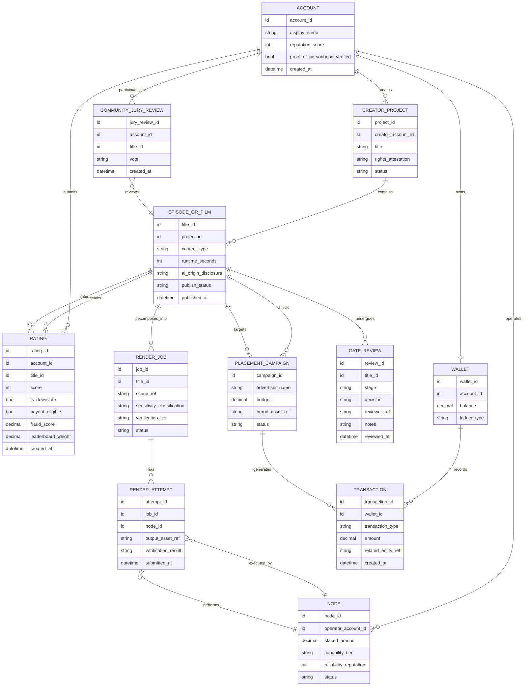

# DESFlix -- Conceptual Data Model

Entity relationships only -- no schema/DDL, no code, per the brief. This is
meant to make sure the subsystem docs (`architecture.md`,
`content-quality-gates.md`, `p2p-rendering.md`, `tokenomics.md`,
`advertising-product-placement.md`) are actually consistent with each other
about what objects exist and how they relate.

## Notes on entities that map directly to open decisions elsewhere

- `RATING.payout_eligible` and `RATING.score` being tracked separately
  reflects `tokenomics.md` D2: a rating can be genuine and count toward the
  engagement-weighted leaderboard while *not* being payout-eligible (e.g.,
  flagged low-trust), or vice versa in edge cases -- the two are not the
  same field on purpose.
- `WALLET.ledger_type` exists because `tokenomics.md` D1 (public token vs.
  permissioned ledger vs. off-chain points) is unresolved; the data model
  doesn't force that decision, it just needs to know which regime a given
  wallet operates under.
- `RENDER_JOB.sensitivity_classification` and `.verification_tier` are the
  fields that drive the routing logic in `p2p-rendering.md` sec. 4 and the
  verification cost model in sec. 3.
- `EPISODE_OR_FILM.ai_origin_disclosure` is the field referenced by
  `content-quality-gates.md` sec. 4 and reused for placement disclosure in
  `advertising-product-placement.md` sec. 5, rather than each doc inventing its
  own disclosure field.
- `ACCOUNT` to `NODE` is one-to-many, not one-to-one: an operator account
  can register several nodes. This is deliberate, not an oversight -- it
  has to be many, because `p2p-rendering.md` sec. 6's collusion analysis
  (an operator running multiple nodes to serve as its own "independent"
  verification peer) only makes sense if the data model allows it. An
  earlier draft of this diagram had it as one-to-zero-or-one, which
  silently contradicted that threat model; caught during review, corrected
  here.
- `RATING.fraud_score` and `.leaderboard_weight` are the fields
  `vote-integrity.md` sec. 3-4 compute and consume: `fraud_score` drives
  the three-band decision (full weight / reduced weight, not payout-
  eligible / rejected), and `leaderboard_weight` is its output -- the
  actual multiplier `tokenomics.md` sec. 5's engagement score applies to
  this rating. Kept as two fields rather than one so the raw fraud signal
  and its downstream effect on ranking stay separately inspectable for
  appeals (`vote-integrity.md` sec. 7).
- The dispute/arbitration states in `p2p-rendering.md` sec. 2's node
  lifecycle (Disputed, Arbitration) are not separate entities here --
  they're represented by multiple `RENDER_ATTEMPT` rows against the same
  `RENDER_JOB` (one per redundant or arbitration run), each with its own
  `verification_result`. No dedicated dispute-record entity is introduced
  because nothing in the current design reads or reports on disputes
  independently of the attempts that make them up; add one if that changes.
