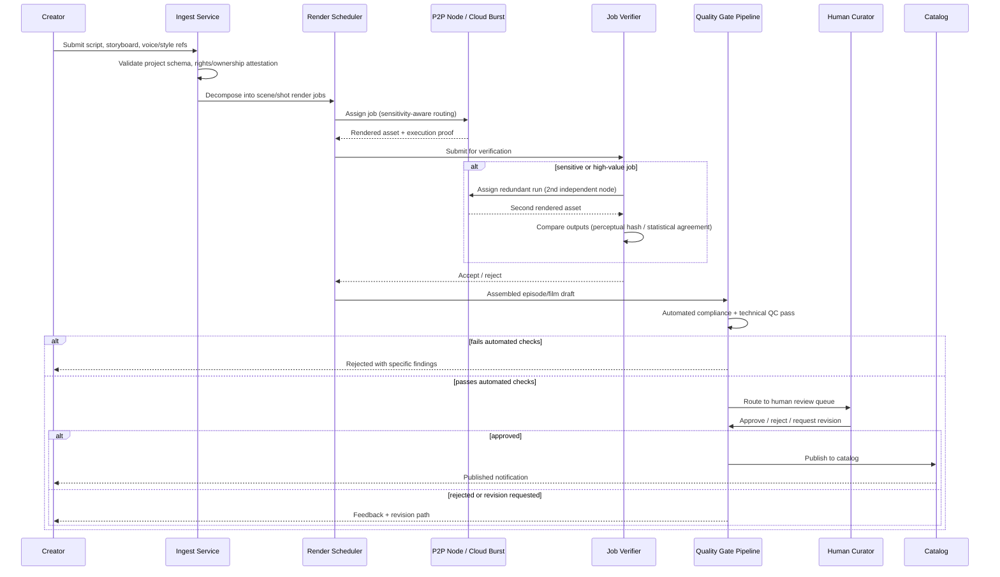
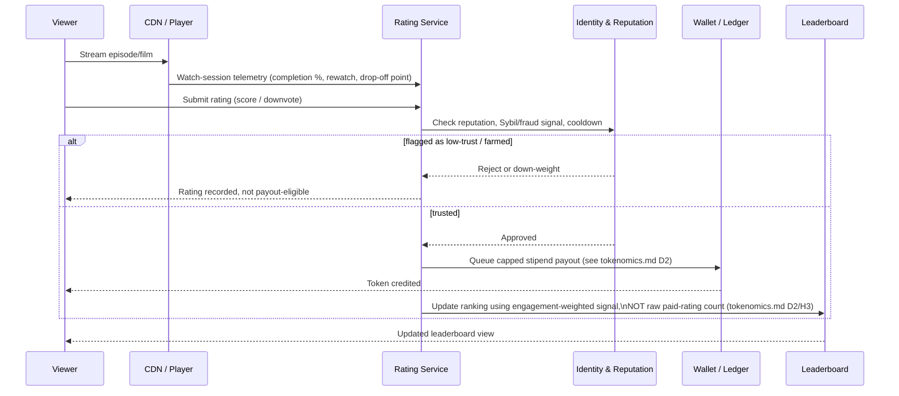
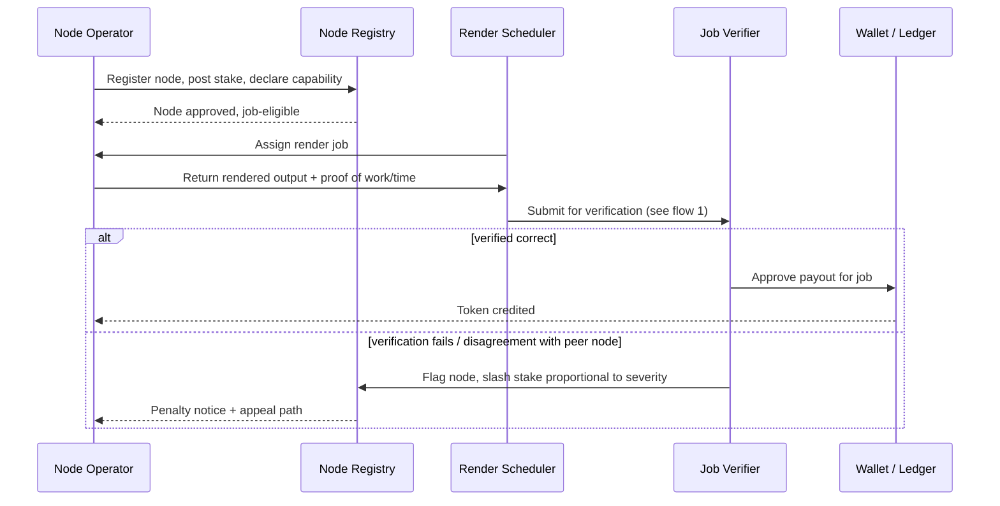
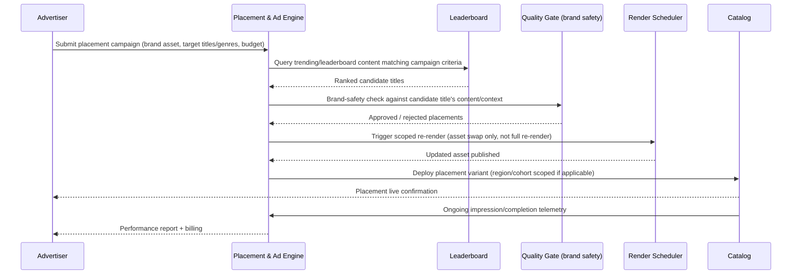

# DESFlix -- Core Dataflows

Four flows cover the product end to end: getting content made, getting it
rendered, getting it watched and rated, and getting it monetized via
placement. Each is a Mermaid sequence diagram plus the failure modes that
matter for that flow specifically (generic retry/timeout handling is assumed
throughout and not re-stated per flow).

## 1. Creator upload -> render -> publish

Failure modes specific to this flow:
- **Node returns corrupted or adversarial output.** Handled by the
  redundant-run verification branch; jobs that disagree beyond a tolerance
  threshold are re-run on a third node and the disagreeing node is
  penalized (see `p2p-rendering.md`). This branch is the main cost driver
  of the P2P path -- it is drawn explicitly rather than assumed away.
- **Rights/ownership dispute** (creator submits content they don't own the
  rights to). Ingest requires an attestation at submission time; this is a
  policy control, not a technical one, and does not fully solve the
  problem -- flagged, not solved, here.
- **Automated gate false-negative** (slop passes automated checks). This is
  why the human curator stage is not optional in this flow -- see the
  confidence rating in `ASSUMPTIONS_AND_RISK.md` sec. 6.

## 2. Viewer watch -> rate -> payout -> leaderboard

Failure modes specific to this flow:
- **Sybil/bot rating farms.** This is the platform's single largest open
  risk (`ASSUMPTIONS_AND_RISK.md` sec. 3). The diagram shows the Identity
  service as a mandatory gate *before* payout, and shows the leaderboard
  computed from engagement signal rather than raw paid-rating volume -- this
  reflects the `H3` recommendation, not a proven solution.
- **Payout without genuine engagement** (rate without watching). Watch-
  session telemetry from the CDN is a prerequisite input to the Rating
  Service specifically so a rating submitted with no corresponding watch
  session can be rejected.
- **Downvote brigading** (coordinated mass-downvoting, e.g. to suppress a
  competitor's content or retaliate against a creator). Same Identity/
  reputation gate applies to downvotes, not only positive ratings.

## 3. Compute contribution -> verification -> node payout

Failure modes specific to this flow:
- **Honest-but-slow nodes penalized unfairly by tight SLAs.** Slashing
  criteria distinguish "wrong output" from "late output" -- only wrong
  output triggers stake slashing; late output affects future job
  eligibility/priority, not stake.
- **Collusion between the assigned node and its redundant-verification
  peer** (two nodes controlled by the same operator agreeing to return
  the same wrong output). Mitigated by peer assignment being unpredictable
  to node operators at assignment time and by requiring peers to be
  independently staked and geographically/network diverse -- this is a
  mitigation, not a guarantee; genuinely sophisticated Sybil node farms
  remain a residual risk, stated plainly rather than hidden.

## 4. Advertiser product placement -> dynamic render -> performance report

Failure modes specific to this flow:
- **Popularity is gamed specifically to attract placement revenue**, closing
  a loop back to the Sybil/rating-farming risk in flow 2 -- placement
  eligibility should key off the same engagement-weighted signal used for
  the public leaderboard, not a separately-gameable metric.
- **Brand safety failure** (placement lands in content that later fails
  moderation, or content whose tone doesn't fit the brand). The brand-
  safety check against Quality Gate output is drawn as a mandatory step
  before any re-render is triggered, not an after-the-fact audit.
- **Re-render introduces visual/continuity artifacts.** Flagged as an open
  feasibility question in `ASSUMPTIONS_AND_RISK.md` sec. 4 ("dynamic product
  placement" falsification row) -- this flow assumes it works; the
  assumptions doc does not.
