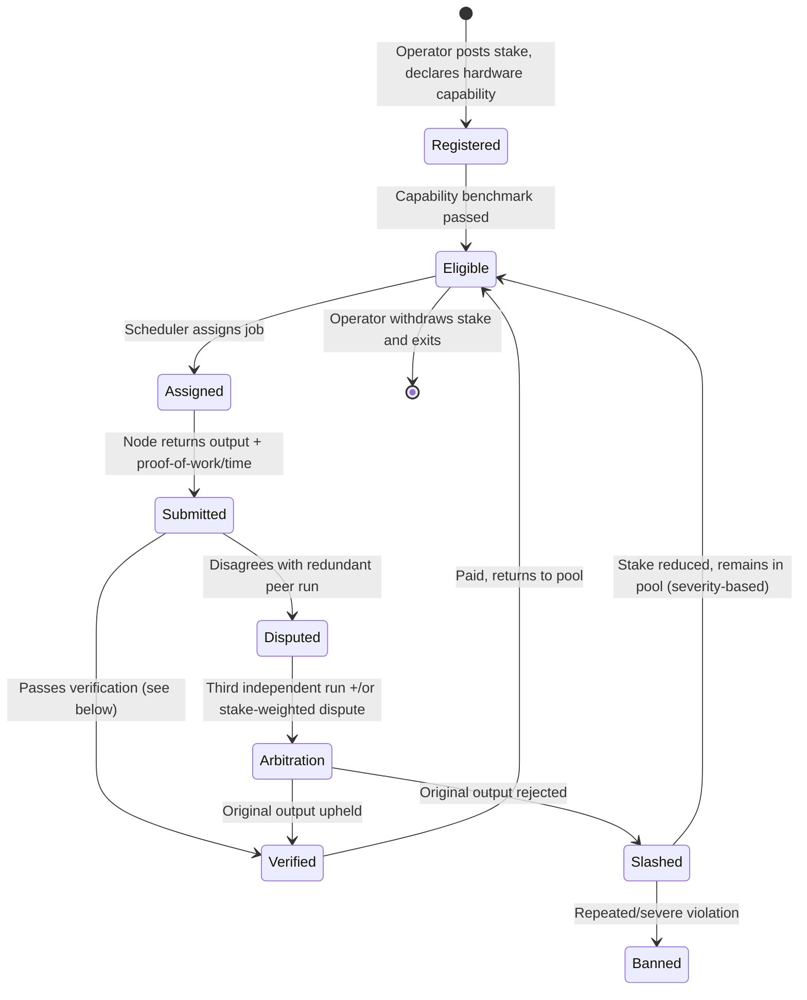
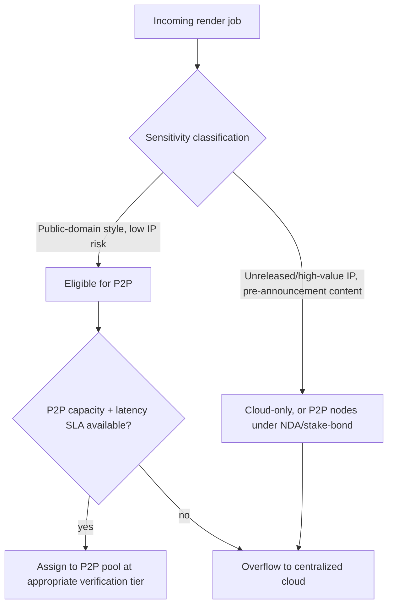

# DESFlix -- P2P Rendering Network

This is the least-proven subsystem in the blueprint (`ASSUMPTIONS_AND_RISK.md`
sec. 2.3, sec. 6: low-medium confidence). This document designs it as an **opt-in
supplement to centralized cloud rendering**, not a replacement, and is
explicit about the verification cost that determines whether it's actually
cheaper than cloud GPU at all.

## 1. Why this is harder than existing P2P compute precedent

Real precedent (`ASSUMPTIONS_AND_RISK.md` sec. 2.1) -- BOINC/Folding@home-style
scientific batch computing, and decentralized video transcoding networks --
works because the *output is cheap to verify*: a scientific result can often
be deterministically recomputed or checked against known bounds, and
transcoded video can be checked against the known source via checksum or
perceptual hash. Generative AI rendering output is different on both axes:

- **Non-deterministic.** Two correct runs of the same generation job on
  different hardware/driver/library versions can legitimately produce
  different (but both valid) output, which makes naive "outputs must match
  exactly" verification unusable.
- **No ground truth to check against.** There is no "known source" to diff
  the output against the way transcoding has the original file.

This is why the architecture below treats verification as a first-class,
costed component, not an afterthought.

## 2. Node lifecycle

## 3. Verification model (the actual cost driver)

Three tiers, chosen per job based on sensitivity and value, because
verifying every job at maximum rigor would erase any cost advantage over
cloud rendering:

| Tier | When used | Method | Cost overhead |
|---|---|---|---|
| Low | Draft/preview renders, low-stakes iteration during creator development | Single node, spot-checked statistically (sample audited after the fact) | ~1x + occasional audit |
| Standard | Scenes headed for Quality Gate submission | Dual independent-node run, perceptual-similarity comparison (not exact match) within tolerance | ~2x |
| High | Final-publish renders, placement-eligible content, high-value catalog titles | Triple run with majority agreement + geographically/operator-diverse node selection to resist collusion | ~3x+ |

The falsification test named in `ASSUMPTIONS_AND_RISK.md` sec. 4 applies
directly here: if Standard-tier cost (roughly 2x a single render, plus
comparison compute) is not below centralized cloud cost for equivalent
output, the P2P path has no economic argument for that tier regardless of
how well the collusion/trust model works, and Phase 3 (`architecture.md`
sec. 5) should not proceed past pilot.

## 4. Job routing / scheduler logic

IP/privacy exposure to node operators is a real cost of the P2P path that
pure BOINC-style precedent doesn't have to deal with (scientific workloads
aren't usually commercially sensitive): a node operator rendering a scene
necessarily sees unreleased creative content. Mitigations, roughly in order
of maturity/practicality, none of them free:

- **Policy/contractual**: node operators agree to confidentiality terms as
  a condition of stake registration; stake is partially forfeit on
  detected leaks.
- **Content-level**: route only lower-sensitivity jobs (background/
  environment renders, non-plot-critical shots) to the general P2P pool;
  keep plot-critical or pre-release-sensitive shots cloud-only.
- **Technical (frontier, not assumed available)**: trusted execution
  environments (TEEs) or encrypted-inference approaches that limit what a
  node operator's hardware can actually observe. This exists as a research
  area; it is **not** assumed as a given capability here, and is called out
  as speculative per `ASSUMPTIONS_AND_RISK.md` sec. 2.3 if relied upon.

## 5. Node operator economics (conceptual, not priced)

Node operators are paid per verified job, scaled by:
- Compute contributed (GPU-hours at a declared/benchmarked capability tier).
- Verification tier of the job (higher-trust jobs pay more, reflecting the
  operator's higher reputation bar to be eligible for them).
- Uptime/reliability reputation multiplier.

No specific token amounts or exchange rates are proposed here -- that's a
market-design and legal question (`tokenomics.md`, `ASSUMPTIONS_AND_RISK.md`
sec. 5), not an architecture question.

## 6. Collusion and Sybil resistance for node operators

Same structural risk as the rating-Sybil problem (`ASSUMPTIONS_AND_RISK.md`
sec. 3), applied to compute instead of ratings: an operator running many nodes
could assign itself as its own "independent" verification peer.
Mitigations:
- Peer assignment for redundant runs is unpredictable to operators at job-
  assignment time (operators cannot know in advance which node will verify
  their output).
- Peer diversity requirements: verification peers must differ in declared
  network origin/ASN and staking account lineage from the primary node,
  raising (not eliminating) the cost of maintaining enough independent-
  looking identities to collude reliably.
- Stake-weighted slashing makes running many low-stake Sybil nodes
  economically unattractive relative to running fewer, well-reputed,
  highly-utilized nodes -- this only holds if the stake requirement is
  calibrated above the expected value of successful collusion, which is a
  tuning problem, not a solved one.

## 7. Fallback posture

Cloud burst capacity is not a last resort bolted on after P2P -- per
`architecture.md` sec. 4/sec. 5, it's a first-class, always-available path. The
platform's core value proposition (curated, no-slop, no-shorts AI content)
does not depend on the P2P network succeeding; the P2P network is additive
capacity/cost optimization and a differentiator *if* it proves out in
pilot, consistent with the phased rollout and the steelman counterargument
in `ASSUMPTIONS_AND_RISK.md` sec. 3.
