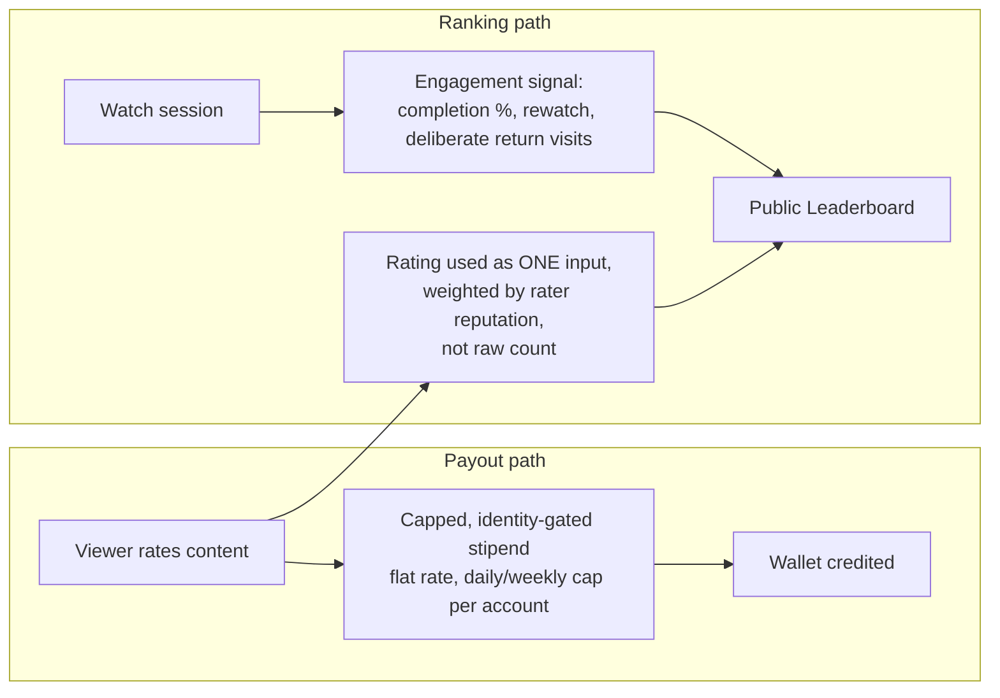
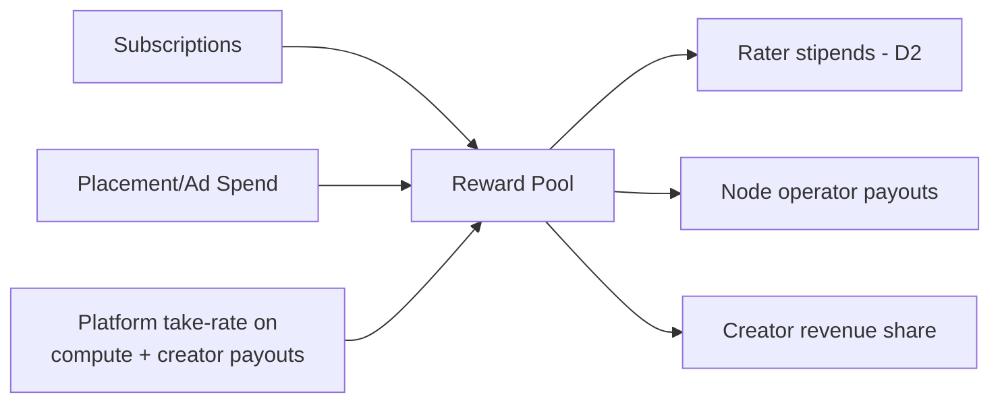

# DESFlix -- Tokenomics and Payments

Read `ASSUMPTIONS_AND_RISK.md` sec. 3 and sec. 5 first. This document does not
re-argue the Sybil/incentive risk analysis; it turns the H3 recommendation
from that analysis into a concrete design, while explicitly marking every
point where the user's original brief (pay directly for rating, H2-style)
diverges from that recommendation, so the choice is visible and reversible
rather than silently substituted.

## 1. `[DECISION] D1` -- Ledger mechanism

Three options, not resolved here:

| Option | Pros | Cons |
|---|---|---|
| Public blockchain token | Transferable, tradable, aligns with "cryptocurrency" as stated in the brief; composable with external crypto ecosystem | Highest regulatory exposure (sec. 5 of risk doc); volatile; gas/settlement cost; hardest to reverse fraud/abuse |
| Permissioned/private ledger, still crypto-branded, limited external transferability | Retains "get paid in a currency, see a balance, cash out" UX; platform retains ability to reverse fraudulent payouts pre-settlement | Less "real crypto," may disappoint a crypto-native audience; still has money-transmission questions once cash-out exists |
| Off-chain points, cash-out via marketplace/payout partner (no on-chain token at all) | Lowest regulatory surface; simplest to build and reverse; still satisfies "get paid for rating" from a user's point of view | Not literally a cryptocurrency; may not satisfy the brief's explicit ask if a real token was the point, not just the payout experience |

Recommendation for Phase 1/2 piloting (`architecture.md` sec. 5): start with
the permissioned-ledger or points-based option, specifically because it
lets the platform pilot the incentive-design questions (H1/H2/H3) and
reverse mistakes cheaply, before taking on the regulatory commitment of a
public, freely-transferable token. This is a sequencing recommendation, not
a claim that a public token is wrong long-term.

## 2. `[DECISION] D2` -- What gets paid, and what drives the public leaderboard

This is the direct operationalization of the H1/H2/H3 hypotheses in the
risk doc.

**As stated in the brief:** rate content, get paid per rating, leaderboard
reflects what's popular. This is the H2-risk design -- paying directly for
the number that becomes the public ranking signal.

**Recommended design (H3):** decouple the two.

Concretely:
- Rating still pays -- the brief's "get paid for rating" holds. But the
  amount is flat and capped per account per period, not proportional to
  how much influence that rating has, which removes the direct financial
  incentive to multiply accounts for more *payout* (there's still a ceiling
  worth attacking, but it's bounded and identity-gated rather than
  unbounded and proportional).
- The leaderboard -- the thing advertisers and other viewers actually see
  and act on -- is computed from engagement telemetry plus
  reputation-*weighted* ratings, so a low-reputation/newly-created account's
  rating barely moves the number that matters, even if that account
  successfully farms its capped stipend.
- This directly reduces the "pay for the exact number you're ranking by"
  structural flaw named in H2, without abandoning "you get paid for rating"
  from the brief.

**If the user prefers the literal brief instead (pay proportional to rating
influence, leaderboard = paid-rating volume):** that's `D2-alt`, and it
should not ship without the pilot-and-compare validation named in
`ASSUMPTIONS_AND_RISK.md` sec. 4 (paid vs. unpaid control cohort convergence
test) -- because the historical base rate in sec. 3 says this is the version
most likely to degrade into bot/Sybil noise.

## 3. Reward pool funding

Token/points paid out to raters and node operators need a funding source;
it should not be an unbacked emission that dilutes value over time without
bound. Funding sources, all real revenue:

- Subscription revenue (assumed baseline monetization, standard for the
  category -- not elaborated further here as it's not differentiated).
- Advertiser/placement spend (`advertising-product-placement.md`).
- A platform take-rate on node-operator compute payouts and/or on
  creator revenue share (standard marketplace economics).

## 4. Anti-Sybil controls (shared infrastructure)

The same identity/reputation service backs rating payouts, community jury
eligibility (`content-quality-gates.md` Stage 4), and node-operator
staking (`p2p-rendering.md` sec. 6) -- one investment in anti-Sybil
infrastructure, reused across three attack surfaces, rather than three
separate ad hoc defenses:

- Proof-of-personhood at account creation (mechanism unspecified -- a
  build-vs-buy decision, real vendors exist in this space per
  `ASSUMPTIONS_AND_RISK.md` sec. 2.1/sec. 3, not named here to avoid asserting a
  specific vendor's current reliability without verification).
- Reputation score per account: age, verification level, historical rating
  behavior vs. eventual community/curator consensus (accounts that
  consistently rate in line with eventual consensus gain weight; accounts
  that don't, lose it).
- Rate limiting / cooldowns on rating frequency per account.
- Stake-to-participate for high-trust tiers (community jury, high-tier node
  verification) raises the cost of a Sybil identity being useful, without
  requiring stake for basic participation (keeps the barrier to entry low
  for ordinary viewers, consistent with this being a consumer product).

## 5. Leaderboard mechanics

- Computed per genre/category, not only globally -- "what's trending in
  comedy" is a more useful signal to creators and advertisers than one
  global ranking dominated by whatever's broadly popular.
- Decays over time (a title's leaderboard position reflects recent signal,
  not lifetime cumulative signal) so the leaderboard stays a "people want
  to see more of this *now*" signal, matching the brief's stated purpose,
  rather than an unbeatable all-time list.
- Publicly shows the engagement-based ranking; does not publicly expose raw
  per-title paid-rating volume, specifically to avoid advertising the exact
  number an attacker would want to farm.

## 6. Explicit non-resolutions

Left to counsel/finance, not this blueprint:
- Actual token/stipend unit values.
- Cash-out mechanics and any exchange-rate or liquidity provisioning.
- Tax reporting obligations for per-user payouts.
- Whether creator revenue share and node-operator payouts settle in the
  same unit as rater stipends or a separate internal accounting unit.
