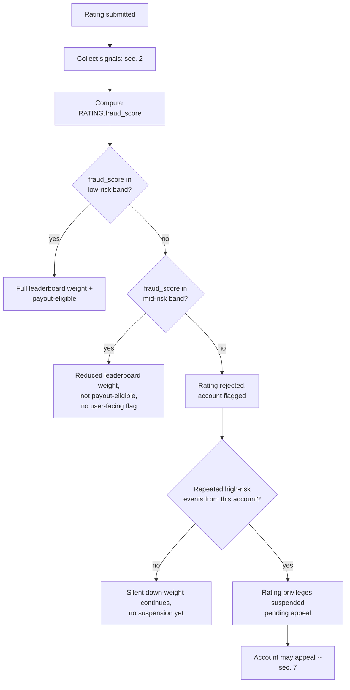

# DESFlix -- Vote Integrity and Fraud Controls

This is the full operational process behind the "no spam votes" requirement
and behind `ACCOUNT.reputation_score` and `RATING.fraud_score` in
[`data-model.md`](./data-model.md). It backs three consumers that would
otherwise each need to build the same defense: leaderboard ranking
(`tokenomics.md` sec. 5), rating payout eligibility (`tokenomics.md` `D2`),
and community jury eligibility (`content-quality-gates.md` Stage 4). One
system, three consumers, not three separately-gameable ones.

Read `ASSUMPTIONS_AND_RISK.md` sec. 3 first -- this document is the
mechanism that section's `H3` recommendation depends on actually working.
Nothing here is claimed as proven; the signals and thresholds below are a
defensible design, not a demonstrated detection rate. Sec. 6 says what
would demonstrate it.

## 1. What this defends against

A rating is worth defending because it does three things at once: it can
pay the rater a stipend, it feeds the public leaderboard, and (for a
sampled subset of accounts) it can be a community-jury vote gating
publication. Any of the three is worth attacking:

- **Farm the stipend.** Many low-effort accounts rating to collect capped
  payouts. Bounded by the cap alone (`tokenomics.md` `D2`), but bounded
  isn't zero, and a large-enough farm still extracts real value.
- **Manipulate the leaderboard.** Coordinated ratings to push a title's
  rank up (inflate a client's or a friend's title) or down (suppress a
  competitor). This is the more damaging attack -- it corrupts the signal
  everyone else relies on, not just the attacker's own payout.
- **Capture the jury.** A creator's associates disproportionately drawing
  jury duty on that creator's own submissions (also addressed structurally
  in `content-quality-gates.md` Stage 4's sampling rule; this document
  covers the identity/reputation layer under that rule).

## 2. Signals collected

Per rating event and per account, not as a single black-box score but as
named, individually-inspectable signals -- so a flagged account can be
told *which* signal triggered, and an appeal reviewer has something
concrete to check.

| Signal | What it measures | Why it's informative |
|---|---|---|
| Proof-of-personhood status | Whether the account completed identity verification | Raises the cost of an additional account; imperfect (sec. 6), but raises cost above zero |
| Account age | Time since account creation | New accounts rating in volume immediately is a recognizable farm pattern; also the noisiest signal alone (real new users exist) |
| Rating velocity | Ratings per unit time, compared to plausible viewing time for the rated runtime | A rating submitted before the runtime could plausibly have been watched is a strong signal, not a weak one |
| Watch-session authenticity | Completion percentage, seek/pause/buffer pattern from the CDN telemetry named in `dataflows.md` flow 2 | Bots that skip straight to "mark watched" don't produce the same telemetry shape as a real playback session |
| Rating-vs-eventual-consensus alignment | Historical correlation between an account's ratings and the title's later, larger-sample consensus | An account that reliably rates in line with eventual consensus is progressively trusted more; one that doesn't, isn't -- this is the slow-build reputation component, not a one-shot check |
| Device/network fingerprint clustering | How many distinct accounts share a device, payment instrument, or IP/ASN cluster | The core Sybil signal: a farm needs many accounts, and those accounts share infrastructure more often than unrelated real users do |
| Timing correlation | Many low-reputation accounts rating the same title within a narrow window, especially right after a placement or leaderboard threshold would be affected | Coordinated brigading has a timing signature organic rating volume doesn't |

## 3. Scoring

Two scores, not one, because they answer different questions and decay at
different rates:

- **`ACCOUNT.reputation_score`** -- a slow-moving, account-level trust
  score built from account age, verification status, and historical
  consensus-alignment. Decays upward slowly with a track record, and
  downward quickly on a confirmed violation.
- **`RATING.fraud_score`** -- a fast, per-event score computed at
  submission time from velocity, watch-session authenticity, fingerprint
  clustering, and timing correlation, combined with the submitting
  account's current `reputation_score` as one input among several.

Neither is specified here as a literal formula (weights are a calibration
exercise against real data, not something this blueprint can responsibly
invent numbers for) -- what's specified is the decision logic that
consumes them, which is what the rest of this document is actually about.

## 4. Decision pipeline

Three bands, not a binary pass/fail, because a binary gate either lets too
much fraud through (threshold too loose) or flags too many real users
(threshold too tight) -- a middle band that quietly reduces weight without
a user-facing penalty absorbs most of the uncertainty in the low- and
mid-confidence range without either failure mode.

**Low-risk band:** counts fully -- full leaderboard weight, stipend paid
(subject to the existing cap in `tokenomics.md` `D2`).
**Mid-risk band:** leaderboard weight reduced (magnitude tunable, not
specified here), stipend withheld, no notice shown to the account --
deliberately silent, so a farm operator doesn't get a real-time signal for
tuning around the threshold.
**High-risk band:** rating rejected outright, does not count toward
leaderboard or payout, account flagged. A single high-risk event does not
suspend an account (see sec. 6 on false positives); a pattern of repeated
high-risk events does, pending appeal.

## 5. Sybil / collusion ring detection

Individual-rating scoring catches individually-suspicious events; it does
not by itself catch a coordinated ring of accounts each individually
scoring in the low- or mid-risk band. That needs a separate, periodic
(not real-time) process: graph clustering over the device/network/payment
fingerprint signal from sec. 2, looking for densely-connected account
clusters with correlated rating targets and timing -- the general
technique category is trust-propagation graph analysis (the same family
as academic Sybil-detection work like SybilRank), named here as an
established category, not claimed as already implemented or benchmarked
for this specific platform.

**On a confirmed cluster:** every account in it is suspended pending
review (not auto-banned -- a dense cluster can occasionally be a real
friend group or a shared-device household; clustering finds candidates,
it doesn't adjudicate them). Confirmed rings: accounts banned, and their
prior ratings are excluded retroactively from leaderboard history.

**Stipend clawback on a confirmed ring is a policy lever, not a
guarantee.** Whether already-paid stipends can be recovered depends
entirely on `tokenomics.md` `D1`: on the recommended permissioned-ledger
default, a pre-cashout clawback is straightforward; on a freely
transferable public token, funds moved off-platform before detection may
be technically unrecoverable. This is a concrete, practical reason to
prefer the permissioned-ledger default for as long as fraud detection is
unproven, not just the regulatory reason `D1` was already flagged for.

## 6. What this does not solve, stated plainly

- **Proof-of-personhood is not proof against Sybil attacks, only a cost
  increase.** Real proof-of-personhood systems have reported large-scale
  farming of their own sign-up process elsewhere; this design assumes the
  same will be attempted here, not that verification solves the problem.
- **A sophisticated attacker adapts to a known threshold.** Publishing
  exact score bands would hand attackers a target to stay under; the bands
  above are described qualitatively here for that reason, and real
  thresholds should not be made public in the same way the Stage 5 rubric
  thresholds are kept non-public in `content-quality-gates.md` sec. 3.
- **False positives have a real cost.** A legitimate binge-watching power
  user can look, on velocity alone, like a farm. The mid-risk silent
  down-weight exists specifically to avoid punishing that user visibly
  while still not paying out or fully weighting an event the system isn't
  confident about -- but the calibration of what counts as implausible
  velocity requires real usage data this blueprint doesn't have. Until
  piloted, treat the velocity thresholds as a hypothesis, not a setting.
- **Falsification test, concrete:** pilot this pipeline against a cohort
  with both paid and unpaid rating tracks (the same test named in
  `ASSUMPTIONS_AND_RISK.md` sec. 4); if the two tracks' rankings still
  diverge sharply after this pipeline's down-weighting is applied, the
  scoring model is not doing its job and the bands need to move, not the
  conclusion that the platform should ship this as-is.

## 7. Appeals

A suspended account can appeal. A human Trust & Safety reviewer sees the
specific signals that triggered the suspension (not a bare "flagged"
notice) and can reverse it. Appeal outcomes are logged as a calibration
signal for the scoring thresholds -- with the caveat that a sophisticated
attacker could in principle use the appeals channel itself to probe the
system's thresholds, which is a reason to rate-limit and manually review
appeal patterns from clustered accounts specifically, not a reason to
remove the appeals channel.

## 8. Audit trail

Every score computation and every band decision is logged with the
specific signal values that produced it, in the `EventLog` store named in
`architecture.md`'s container diagram -- required for appeals to be
answerable at all, and for the platform to be able to show, after the
fact, why a given rating did or didn't count.
